

<a href="https://ahmedrazasahoo.github.io/"></a>

  <a href="https://github.com/ahmedrazasahoo?tab=repositories">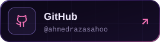</a>  

<a href="https://domaintoiptrace.com/"></a> <a href="https://applefurniture.pk/"></a> <a href="https://emkanerp.frappe.cloud/"></a>
<a href="http://rdemo.platia360.com/"></a> <a href="https://teachafy.com/"></a> <a href="https://github.com/NexTash/Qetah-Phase-1"></a>

<a href="https://github.com/ahmedrazasahoo?tab=repositories"></a>

<a href="https://ahmedrazasahoo.github.io/"></a> <a href="https://ahmedrazasahoo.github.io/"></a>

<a href="https://github.com/ahmedrazasahoo?tab=repositories"></a> <a href="https://ahmedrazasahoo.github.io/"></a>

<a href="https://ahmedrazasahoo.github.io/"></a>

<a href="https://ahmedrazasahoo.github.io/"></a>

<a href="mailto:ahmedrazasahoo@gmail.com"></a>

