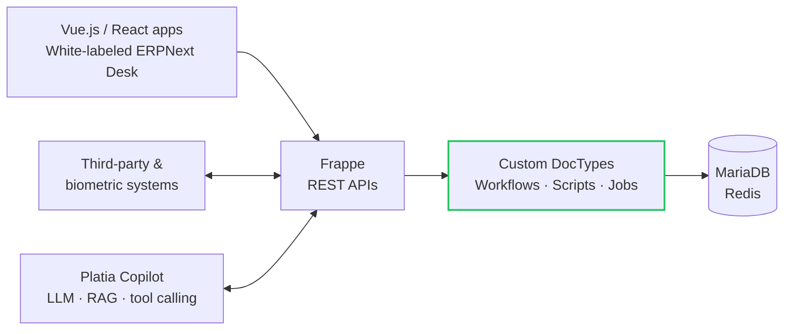
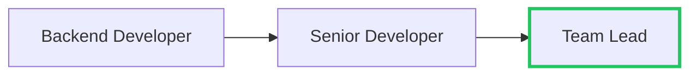

<div align="center">

# Ahmed Raza

**Frappe & ERPNext Developer** · Team Lead @ NexTash · Lahore, Pakistan

<sub>Custom ERPNext modules&nbsp; · &nbsp;REST API integrations&nbsp; · &nbsp;Workflow automation&nbsp; · &nbsp;AI on ERPNext</sub>

<br>

[**Portfolio**](https://ahmedrazasahoo.github.io/) &nbsp;·&nbsp;
[**Email**](mailto:ahmedrazasahoo@gmail.com) &nbsp;·&nbsp;
[**Repositories**](https://github.com/ahmedrazasahoo?tab=repositories) &nbsp;·&nbsp;
[**Followers**](https://github.com/ahmedrazasahoo?tab=followers)

</div>

> **Open for freelance & long-term Frappe / ERPNext projects.** Got one? Reach me at [ahmedrazasahoo@gmail.com](mailto:ahmedrazasahoo@gmail.com)

## About

```yaml
name:      Ahmed Raza
role:      Frappe / ERPNext Developer · Team Lead @ NexTash
based_in:  Lahore, Pakistan
builds:
  - Custom ERP solutions, modules, APIs & business automation
  - Clean, scalable code with a strong business-logic focus
exploring: AI integrations with ERPNext + modern frontend
```

## Featured Projects

<table>
<tr>
<td width="50%" valign="top">

### Apple Furniture — E-Commerce
Full-featured e-commerce platform for Apple Furniture & Interior. Vue.js frontend for a fast, responsive shopping experience; Frappe/ERPNext backend runs the entire sales lifecycle — inventory, customers, orders.

`Vue.js` `Frappe Framework` `ERPNext`

**Live** → [applefurniture.pk](https://applefurniture.pk/)

</td>
<td width="50%" valign="top">

### EMKAN Engineering ERP
Custom enterprise platform for a Qatar-based engineering, fabrication & contracting company. Workflows for Material Requests, Purchase Orders & Receipts, Payments, Stock Entries and vehicle service requests, plus custom reports, dashboards and permissions.

`ERPNext` `Python` `JavaScript` `Vue.js` `REST APIs`

**Live** → [emkanerp.frappe.cloud](https://emkanerp.frappe.cloud/)

</td>
</tr>
<tr>
<td width="50%" valign="top">

### Platia Copilot
AI-powered enterprise assistant built on ERPNext/Frappe. Skill-based architecture, tool calling for backend operations, RAG over ERP knowledge, role-based access and multi-model LLM support.

`AI/LLM` `RAG` `Python` `ERPNext` `REST APIs`

**Demo** → [rdemo.platia360.com](http://rdemo.platia360.com/)

</td>
<td width="50%" valign="top">

### Teachafy — ERPNext & HRMS
ERPNext + Frappe HRMS for employees, attendance, leave & shifts. Fully white-labeled ERPNext UI (theme, branding, dashboards, login screens) matched to the Teachafy website, plus biometric attendance integrations via REST APIs.

`Frappe HRMS` `White-Labeling` `MariaDB` `REST APIs`

**Live** → [teachafy.com](https://teachafy.com/)

</td>
</tr>
<tr>
<td width="50%" valign="top">

### Qetah Phase 1
Custom ERPNext solution for a freelance services platform — client/freelancer profiles, job posting & bidding, milestone tracking, invoicing and crypto wallet-based payments & payouts.

`Frappe` `ERPNext` `MariaDB` `Crypto Payments`

**Code** → [NexTash/Qetah-Phase-1](https://github.com/NexTash/Qetah-Phase-1)

</td>
<td width="50%" valign="top">

### More on GitHub
Frappe apps, client projects, experiments — and this profile itself.

**Got a Frappe / ERPNext project?** Open to freelance & long-term collaborations.

**Browse** → [all repositories](https://github.com/ahmedrazasahoo?tab=repositories)

</td>
</tr>
</table>

## Current Focus

<sub>WHAT I'M BUILDING NOW</sub>

| Focus | What it is | Status |
|:--|:--|:--:|
| **Platia Copilot** | AI enterprise assistant on ERPNext — skills, tool calling, RAG over ERP data | `ACTIVE` |
| **Team Lead · NexTash** | Leading custom ERPNext modules, workflows and integrations for clients | `ONGOING` |
| **AI + ERPNext** | Bringing LLM integrations and modern frontends to Frappe apps | `EXPLORING` |
| **Freelance projects** | Frappe / ERPNext implementations, customization and support | `OPEN` |

## Principles

<sub>HOW I WORK</sub>

<table>
<tr>
<td width="25%" valign="top">

**01 · Discovery**

Understand your business processes & requirements

</td>
<td width="25%" valign="top">

**02 · Scope & Proposal**

Define deliverables, timeline & pricing

</td>
<td width="25%" valign="top">

**03 · Development**

Build, customize & test in iterative cycles

</td>
<td width="25%" valign="top">

**04 · Support & Handoff**

Documentation, training & ongoing support

</td>
</tr>
</table>

> Clean, scalable code with a strong business-logic focus.

## System Architecture

<sub>HOW MY ERPNEXT SOLUTIONS FIT TOGETHER</sub>



## Tech Radar

<sub>WHAT I USE, AND HOW OFTEN</sub>

| Ring | Technologies |
|:--|:--|
| **Core** — every day | `Python` `Frappe` `ERPNext` `MariaDB` `JavaScript` `REST APIs` |
| **Frontend** — client-facing builds | `Vue.js` `React` `Tailwind CSS` `HTML5` `Jinja` |
| **Platform** — run & ship | `Redis` `Docker` `Git` `VS Code` `Frappe HRMS` |
| **Exploring** — next up | `AI/LLM Integration` `RAG` `Tool calling` |

## Experience

### Team Lead · NexTash
**Full-time** · On-site · Lahore, Punjab, Pakistan · **May 2022 – Present**



- Design and develop custom ERPNext modules and DocTypes tailored to specific business requirements
- Extend core ERPNext functionality with custom backend logic that fits existing business workflows
- Build custom workflows and business rules to automate approval chains and operational processes
- Craft server scripts, client scripts & scheduled jobs to streamline business processes within ERPNext
- Integrate ERPNext with internal & third-party systems via REST APIs for seamless data exchange
- Troubleshoot backend issues and optimize performance for system reliability & data integrity

`Frappe` `ERPNext` `Python` `Back-End Development` `Workflow Automation` `REST APIs`

## GitHub Stats

<!--
  scripts/generate_stats.py rewrites the text between these markers
  daily (.github/workflows/update-stats.yml). Plain text, no images.
-->
<!--GITHUB-STATS-START-->
| Public Repos | Total Stars | Followers | Following |
|:---:|:---:|:---:|:---:|
| 15 | 6 | 5 | 5 |

**Most Used Languages:** HTML 38.5% • Python 30.8% • Vue 15.4% • TypeScript 7.7%
<!--GITHUB-STATS-END-->

<!--STREAK-STATS-START-->
🔥 **1,451** total contributions &nbsp;·&nbsp; **1**-day current streak &nbsp;·&nbsp; **8**-day longest streak
<!--STREAK-STATS-END-->

## Connect

| Where | Link | Best for |
|:--|:--|:--|
| **GitHub** | [@ahmedrazasahoo](https://github.com/ahmedrazasahoo) | Code & open source |
| **Email** | [ahmedrazasahoo@gmail.com](mailto:ahmedrazasahoo@gmail.com) | Projects & hiring |
| **Portfolio** | [ahmedrazasahoo.github.io](https://ahmedrazasahoo.github.io/) | Full profile |
| **Instagram** | [@ahmedrazasahoo](https://instagram.com/ahmedrazasahoo) | |
| **Facebook** | [@ahmedrazasahoo](https://facebook.com/ahmedrazasahoo) | |
<!-- Add once you have your real LinkedIn URL:
| **LinkedIn** | [Connect](https://www.linkedin.com/in/YOUR-REAL-PROFILE) | |
-->

---

<div align="center">

**Visit my portfolio**<br>
[ahmedrazasahoo.github.io](https://ahmedrazasahoo.github.io/)

<sub>Open to freelance & long-term Frappe / ERPNext projects</sub>

</div>
